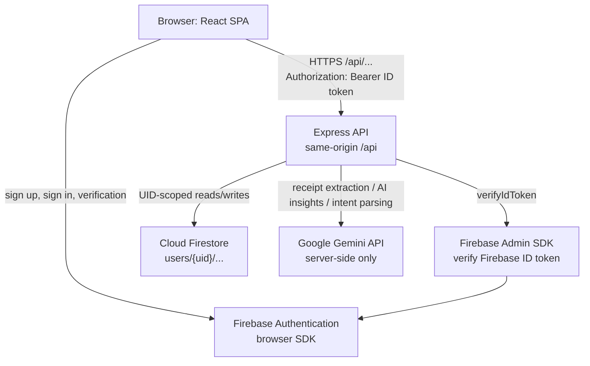

# Current architecture

## Request and data flow

There is no vector database, relational database, bank connection, external file store, or general Replit service in the current application path.

## What runs where

### Browser

- React 19 and TypeScript build into the SPA served from `dist/client`.
- React Router uses browser history routes such as `/dashboard`, `/transactions`, and `/ai-finance`.
- Firebase's browser SDK handles email/password authentication and keeps Firebase auth state with `browserLocalPersistence`.
- `client/src/lib/api-client.ts` sends API calls to root-relative `/api/...` paths. Authenticated calls attach the current Firebase ID token as `Authorization: Bearer ...`.
- The browser may receive only `VITE_FIREBASE_*` configuration. Vite embeds those values in the public bundle; they must not contain service-account credentials or provider secrets.

### Server

- `server/src/index.ts` starts Express, chooses production static serving when `NODE_ENV=production`, binds to `0.0.0.0`, and reads `PORT` (default `5000`).
- In production, Express serves the Vite files from `dist/client`, routes `/api` to API handlers, and returns `index.html` for non-API GET routes to support React Router.
- `server/src/auth/middleware.ts` requires a Firebase ID token and verified email for private routes. The UID used by repositories comes from the verified token, not the request body.
- Transaction, budget, and goal data are stored in Firestore under `users/{uid}/...` through Firebase Admin repositories. Analytics and other derived values are calculated by server code.
- Receipt uploads are held in memory for validation and extraction. The application does not persist uploaded image bytes.
- Google Gemini is called only from server services. Receipt data is returned for user review; AI Insights receives derived facts; AI Finance uses Gemini only for constrained intent extraction. Financial calculations remain server-side.

## Service and secret boundaries

| Kind | Variables | Where used |
|---|---|---|
| Public browser configuration | `VITE_FIREBASE_API_KEY`, `VITE_FIREBASE_AUTH_DOMAIN`, `VITE_FIREBASE_PROJECT_ID`, `VITE_FIREBASE_STORAGE_BUCKET`, `VITE_FIREBASE_APP_ID` | Firebase browser SDK; compiled into the client bundle |
| Backend-only credentials | `FIREBASE_PROJECT_ID`, `FIREBASE_CLIENT_EMAIL`, `FIREBASE_PRIVATE_KEY` | Firebase Admin authentication and Firestore |
| Backend-only provider key | `GEMINI_API_KEY` | Google Gemini API calls |
| Runtime settings | `PORT`, `NODE_ENV` | Express bind port and production/development serving branch |

`FIREBASE_PROJECT_ID` appears in both public and private configuration with different prefixes and uses. The browser Firebase web configuration is public by design; Firebase Admin service-account credentials and the Gemini key must stay in server-side environment variables.

## Deployment shape

The supported default is one Node service serving the frontend and API from the same origin. A frontend static host and a separate API service can be used behind a same-origin reverse proxy. The current browser code has no API origin setting and the server has no CORS middleware, so direct cross-origin frontend-to-API calls are not configured.